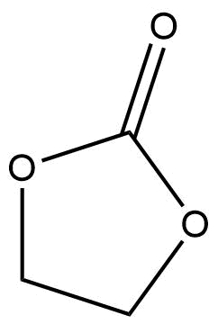

# Euro HPC MD software

This repository contains input files and results of research done under the EuroHPC project. Supplementary Python scripts for preparation of input files are also included. Studied software included four packages for molecular dynamics (MD): CP2K, CPMD, DFTB+ and NAMD.

Artifacts with detailed reports are collected in the appropriate subdirectories:

* [CP2K](./cp2k/)
* [CPMD](./cpmd/)
* [DFTB+](./dftb-plus/)
* [NAMD](./namd/)

Systems used for all of studied software was ethylene carbonate (EC) with different number of molecules, from 1 to 3200 molecules in the simulation box. Initial .xyz files are stored in directory [start](./systems-xyz/ec/start/), optimized by CP2K in directory [cp2k-optimized](./systems-xyz/ec/cp2k-optimized/). Systems were used either with periodic boundary conditions (PBC) or without them, for PBC box sizes are in the file [cell-vectors](./systems-xyz/ec/cell-vectors). The EC molecule is presented below.

Directory [systems-xyz](./systems-xyz/) contains additional scripts used for preparation of geometries.