# CP2K

Here are presented some general tips for use-cases studied in this project. All studied systems consisted of different numbers of ethylene carbonate (EC) molecules.

Basis sets and pseudopotentials are collected in `utils/` subdirectory, they are taken from [CP2K repository](https://github.com/cp2k/cp2k/tree/master/data). There also the `t_c_g.dat` file used in B3LYP and MP2 could be found. For standard DFTB the `3-ob` parameter set was used, it could be downloaded from the [DFTB website](dftb.org).

In subdirectories input files for single-point energy calculation, geometry optimization, TD-DFPT and MD with BO method, SGCP and DFTB approaches are included.

## Single-point energy

Four methods were studied: MP2 and DFT with three different functionals: B3LYP, PBE and BP.
For single-point energy graphs with CPU times and results for examination of scalling

### B3LYP

* very slow, has problems with optimization
* for systems bigger than several molecules has problem with nonfully occupied KS matrix, it could be resolved with setting EPS_PGF_ORB parameter, although for big systems it is not possible to avoid this warning
* needs additional file with truncated potentials for HF (t_c_g.dat)
* default 200 steps of SCF is usually sufficient
* needs to set cutoff radius, it should be less or equal half of the longest box edge length
* maximal reasonable system size: 16 molecules

### PBE

* reasonable speed
* lower convergence speed than for B3LYP, needs to increase default maximal number of SCF steps
* maximal reasonable system size: 400 molecules

### BP

* speed similar to PBE
* lower convergence speed than even for PBE, definitely needs to increase MAX_SCF parameter
* does not have dedicated DZVP_GTH basis set, needs to use the general one
* Grimme's dispersion correction is named BP86
* maximal reasonable system size: 800 molecules

### MP2

* very slow
* similar problems with EPS_PGF_ORB parameter as for B3LYP
* as B3LYP needs the file with truncated potentials for HF (t_c_g.dat)
* memory size and threads number need to be declared inside input file
* needs big amount of memory, declared in input values could be exceeded even twice
* as for B3LYP needs properly set cutoff radius
* special basis sets, here TZV2P was used
* maximal reasonable system size: 4 molecules

## Geometry optimization

* it is better to declare bigger memory than expected - after some steps it sometimes causes out-of-memory errors
* MPI throws strange errors when used number of threads is too big for given system size

## Born-Oppenheimer Molecular Dynamics

* throws out-of-memory error if too many steps are calculated in one task (more than 4000-5000), so it is better to have more frequent restarts for small systems

## TD-DFPT

* can use only GPW functions
* needs only to add PROPERTIES section, could be used both for single point calculations as well as for molecular dynamics

## Second Generation Car-Parinello Molecular Dynamics

* use not too strict convergence criteria (10-5 should be enough)
* it is suggested to start with preoptimized in Born-Oppenheimer MD wavefunction (.wfn file, SCF_GUESS RESTART)
* use small timesteps
* it could be slowly convergent, thus it is better to increase MAX_SCF value
* it has GAMMA and NOISY_GAMMA parameters which should be tuned to the particular system, by perfmorming simulations with their different values and monitoring if the temperature is kept constant
* needs FULL_ALL preconditioner
* [reference for this method](https://groups.google.com/g/cp2k/c/kkZDig18nE4) (last access: 12.07.2023)

## DFTB and xTB

* as for Car-Parinello it also needs not too strict convergence criteria
* .skf files from dftb.org are working
* needs FULL_ALL preconditioner
* it is possible to use Grimme's D3 dispersion correction in standard DFTB
* for xTB at the moment (July 2023) only GFN1 variant is available, although it is planned to implement also GFN2

## Use of GPU

* does not need any additional declarations in the input file

# Results of experiments

## Single-point energies

For every studied method plots of walltime, CPU time, used CPUs and used memory vs number of molecules are presented in following subsections. For each of these method parallelisation metrics (speedup and efficiency) were measured for fixed system size and varying number of CPUs used.

### B3LYP

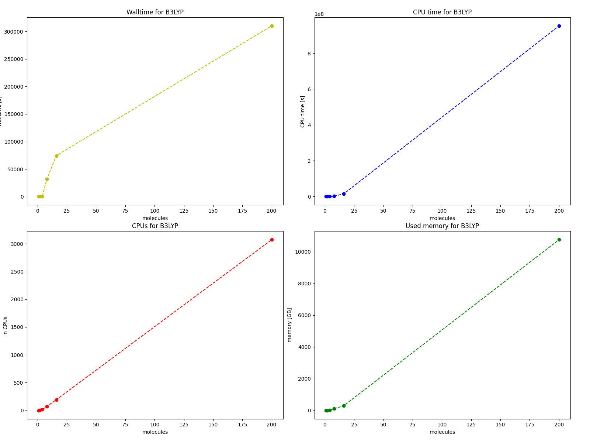

Parallelisation studies were performed for a system with 4 EC molecules:

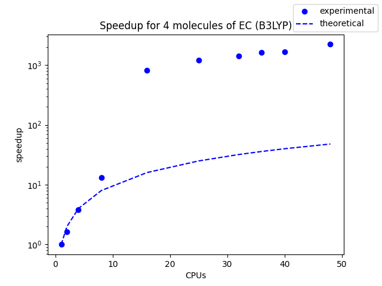
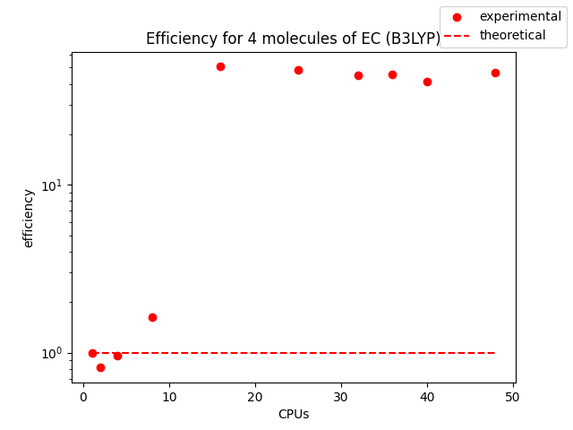

An anomalous behaviour was observed, the measured speedups exceed theoretical values, thus it is suggested to use more than 1 CPU for B3LYP.

### PBE

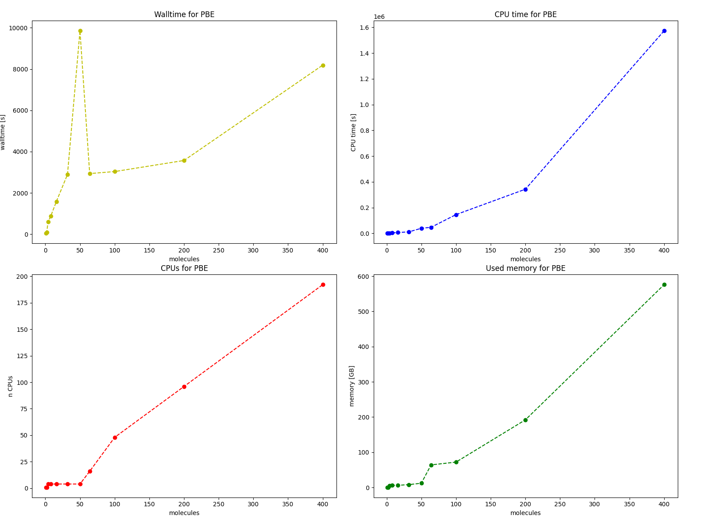

Parallelisation studies were performed for a system with 50 EC molecules:

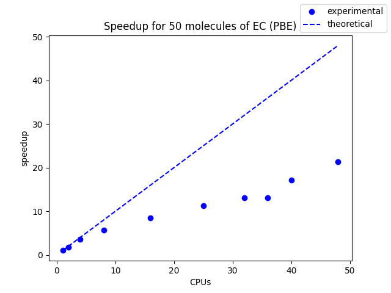
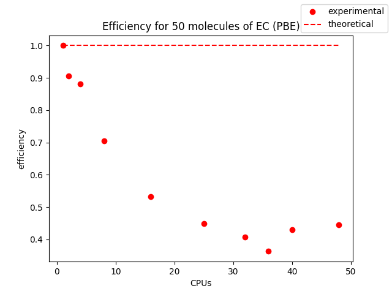

Here, the behaviour is as expected.

### BP

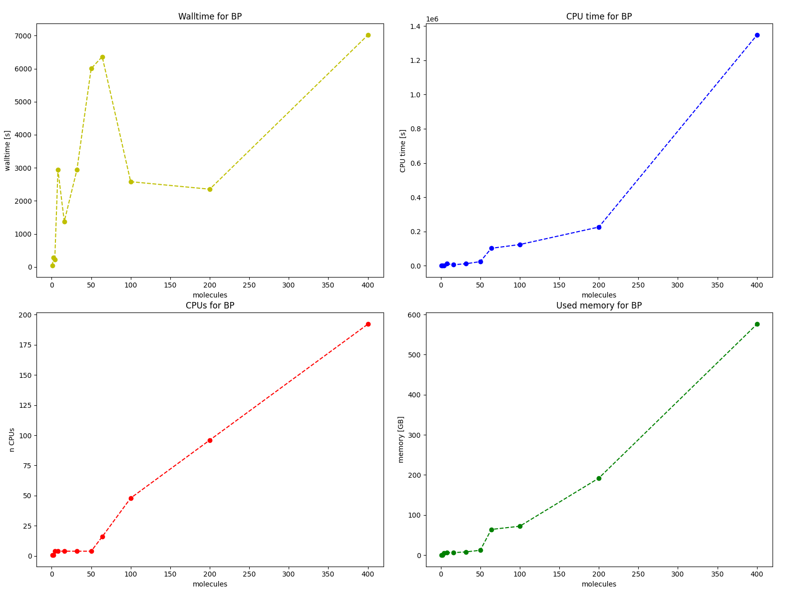

Parallelisation studies were performed for a system with 50 EC molecules:

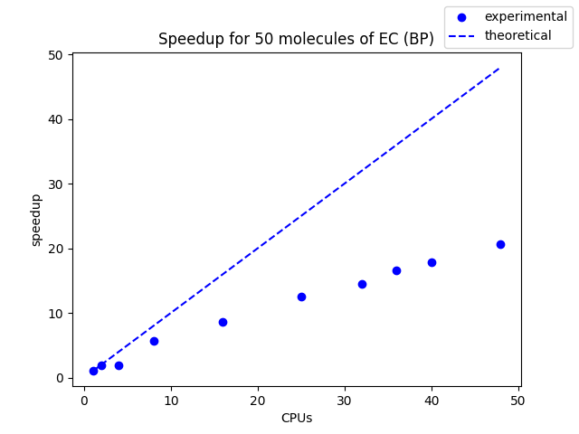
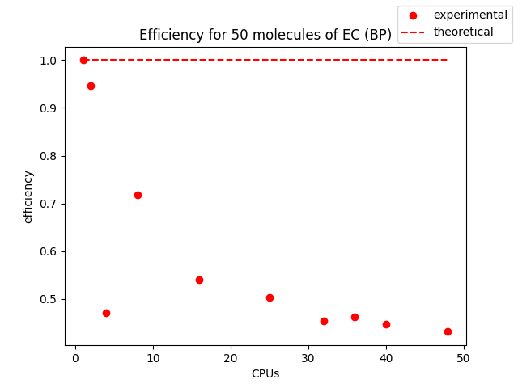

As for PBE, the behaviour is typical.

### MP2

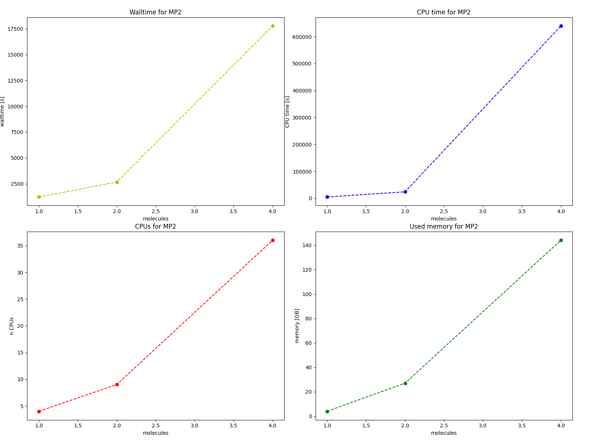

Studied range of system sizes was quite narrow, due to high memory requirements and low speed of the MP2 method. The parallelisation studies were performed for a system with 2 EC molecules, as for B3LYP the observed behaviour is anomalous. It seems that such behaviour could be connected with HF calculations in CP2K (as B3LYP also involves such calculations).

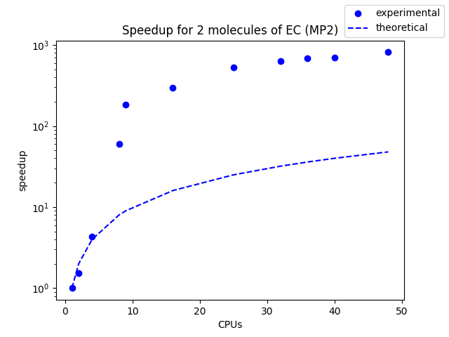
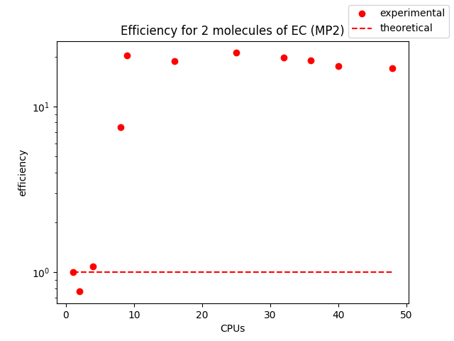

## Molecular dynamics

Speed of different MD approaches were compared for Born-Oppenheimer MD with PBE or BP functional, Second-Generation Car-Parinello MD (SGCPMD) and Tight-Binding methods - DFTB with 3ob parameterisation and GFN1-xTB.

As a metric for each method number of timesteps per (time unit * number of CPUs) was used.

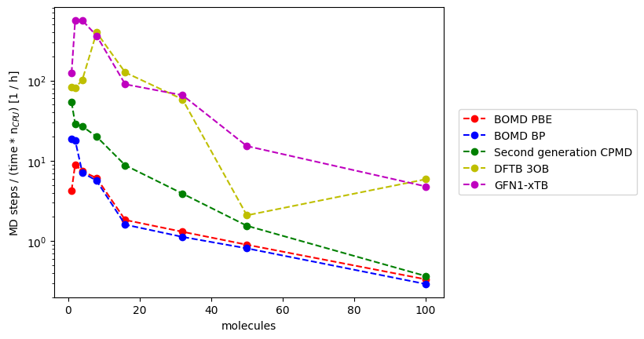