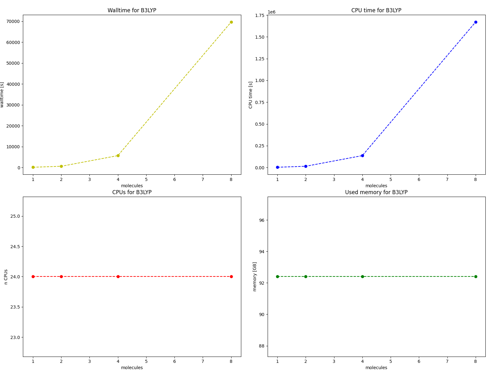
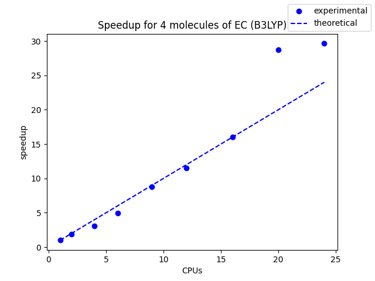
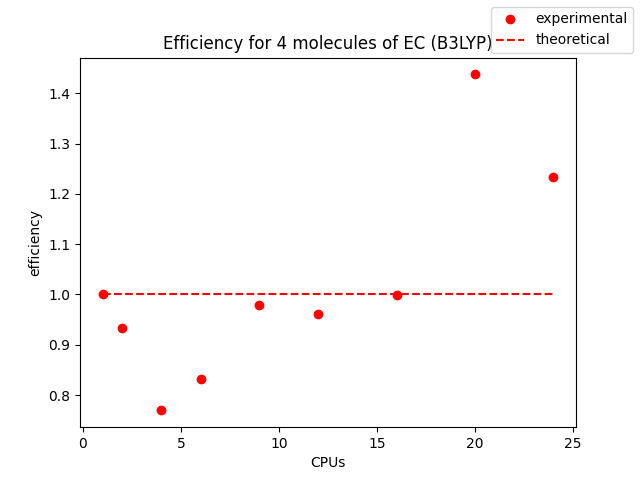
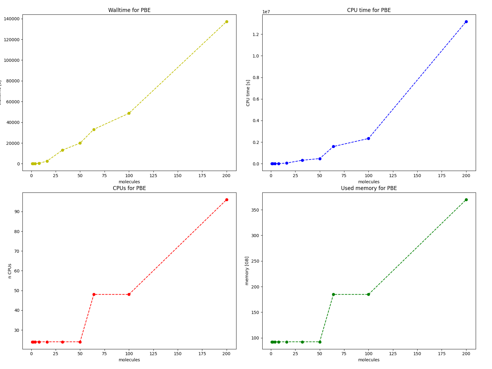
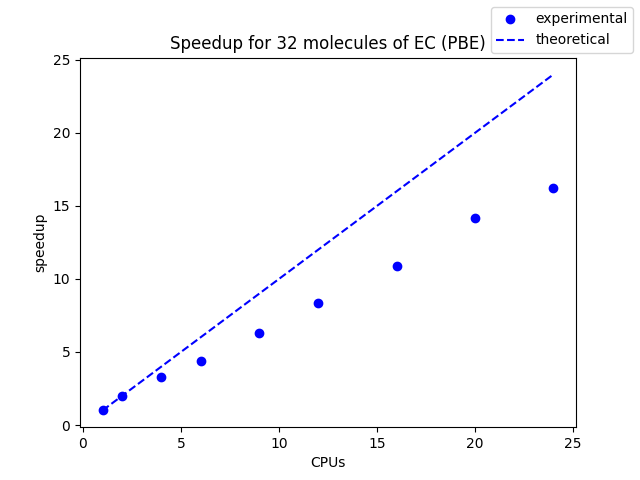
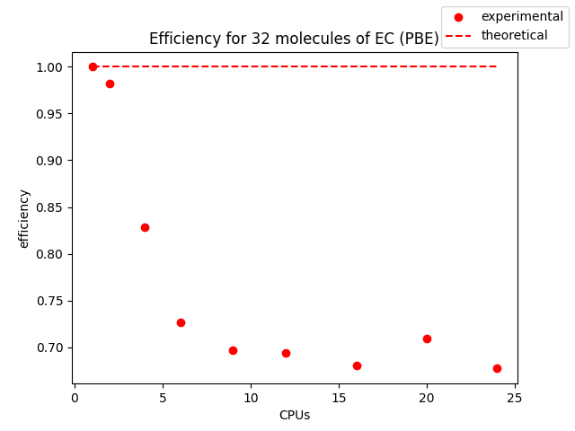
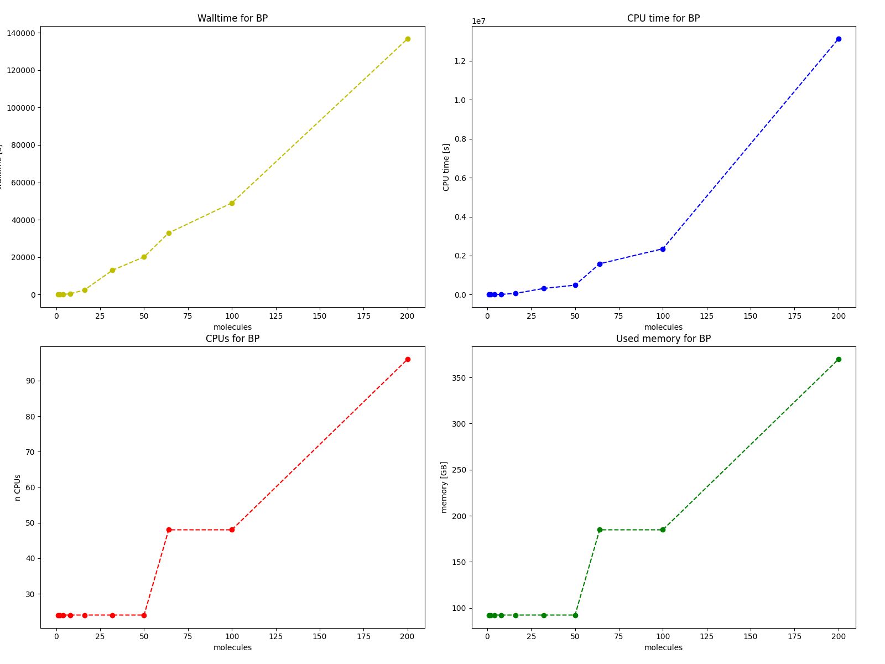
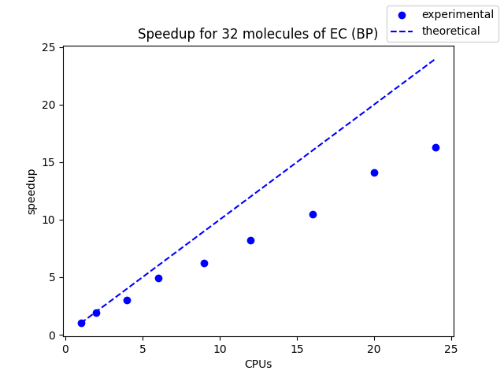
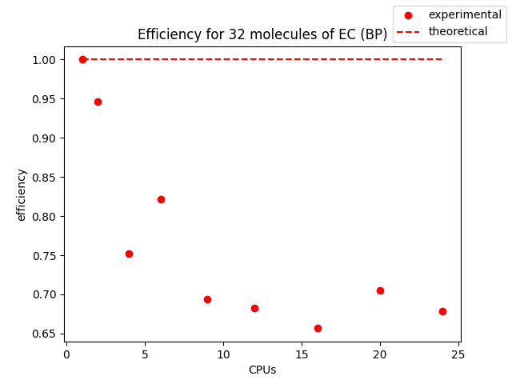
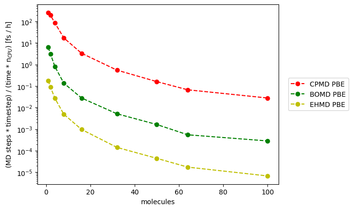

# CPMD

For experiments, Goedecker pseudopotentials were used. They need to have an appropriate file format (.psp files) which could be downloaded from this [link](https://htmlpreview.github.io/?https://github.com/cp2k/cp2k-data/blob/master/potentials/Goedecker/index.html).

For preparation of &ATOMS section of the input file, additional script `prepare_atoms_section.py` is included. It is used as:
```
python3 prepare_atoms_section.py input
```
Input file should be in .xyz format. For using elements not included in the script, the ATOM_PSEUDOPOTENTIALS list at the beginning should be modified providing name of the .psp file for given element and l-max value.

In subdirectories input files for single-point wavefunction optimization, geometry optimization, vibrational analysis, TD-DFT, linear response calculations (NMR, Raman, Fukui indices), and MD with BO method, Car-Parinello method (CPMD) and Ehrenfest method (EHMD).

## Guidelines for user

* for launch it is needed to give path to .psp files (setting environmental variable CPMD_PP_LIBRARY_PATH is not working)
* input file at some parts is sensitive to white signs, in lines with declaration of pseudopotential files the * sign must be at the first column
* SYMMETRY keyword is a bit tricky - 1 does not mean point group 1 but cubic cell, 8 means orthorombic and 6 tetragonal
* tetragonal unit cell needs that first two cell vectors have the same length, other permutations do not work
* for non-periodic calculations it is possible to use SYMMETRY 0, however it is suggested by developers to use periodic calculations with big simulation box for that case (CPMD is optimized for periodic calculations)
* B3LYP is slow, maximum system size: 8 molecules, for PBE and BP maximum system size was 200 molecules. 400 molecules of EC needs more memory than CPMD is able to handle
* for geometry optimization it is possible to start from previously optimized wavefunction (using appropriate RESTART keyword)
* it is helpful to add XYZ keyword to OPTIMIZE GEOMETRY, it causes that every optimization step is printed into the .xyz output file
* first geometry optimization needs keyword HESSIAN UNIT (to initialize Hessian)
* files such as GEO_OPT.xyz or HESSIAN are saved by default in directory slurm_jobdir/id_of_task, to avoid this it is needed to appropriately set environmental variables TMPDIR and CPMD_FILEPATH
* it is impossible to perform geometry optimization and vibrational analysis within one task
* VIBRATIONAL ANALYSIS with keyword IN does not produce output file for Molden (word GAUSS is then ignored)
* for geometry optimization it is better to use convergence criterium lower than $10^{-4}$
* to print dipole moments during MD simulation it is enough to use words DIPOLE DYNAMICS,, it is not necessary to declare DIPOLE MOMENT section
* keyword XYZ with MOLECULAR DYNAMICS descripts only the format in which input geometries are read, to save trajectory to .xyz file it is necessary to use TRAJECTORY XYZ keywords
* Ehrenfest MD produces NaN values with too large timestep, the timestep should be about 0.01 a.u.
* Grimme's dispersion correction D2 is available, D3 is not implemented however it is possible to define it manually
* TD-DFT: when it is an addition to geometry optimization or MD simulation, TDDFT keyword is used, for single-point TD-DFT it is needed to use words ELECTRONIC SPECTRA
* RAMAN keyword makes calculation of polarizabilities, partial charges and dipole moments
* for NMR there is FULL option available good for periodic systems however it is computationally expensive. Shieldings are printed in ppm, but they are not scalled with respect to the internal standard, values are printed for vacuum and with correction for condensed phase
* in NMR for atoms different than hydrogen it is better to use other than standard pseudopotentials, such that to include also nonvalence electrons (or use semi-empirical corrections)
* standard system in NMR (TMS) is here hard to compute, to obtain relative shifts it is more suitable to calculate shifts for methane, calculate relative shifts with respect to methane and then compare values with experimental values for methane
* Fukui function calculations need to specify the orbitals, and files with wavefunctions are needed. Such files can be produced by wavefunction optimization with the use of RHOOUT keyword along with word BANDS and giving numbers of studied orbitals as negative numbers
* LATEST output file contains the path to the restart file and in the second line integer number which is the integer part of all calculated energies (output log file contains only the non-integer part)


# Results of experiments

## Wavefunction optimization

For every studied functional (B3LYP, BP, PBE) plots of walltime, CPU time, used CPUs and used memory vs number of molecules are presented in following subsections. For each of these method parallelisation metrics (speedup and efficiency) were measured for fixed system size and varying number of CPUs used.

### B3LYP



Parallelisation studies were performed for a system with 4 EC molecules:




An anomalous behaviour was observed, for more than 20 CPUs measured value exceeds the theoretical one. Thus, it is suggested to use maximal number of CPUs per node for this functional.

### PBE



Parallelisation studies were performed for a system with 32 EC molecules:




Here, the behaviour is as expected and similar to CP2K.

### BP



Parallelisation studies were performed for a system with 32 EC molecules:




As for PBE, the behaviour is typical.

## Molecular dynamics

Speed of different MD approaches were compared with PBE functional: Car-Parinello MD (CPMD), Born-Oppenheimer MD (BOMD) and Ehrenfest MD (EHMD).

As a metric for each method number of timesteps times value of timestep per (time unit * number of CPUs) was used.



Observed relations are similar and as expected - the fastest method is CPMD and the slowest EHMD.