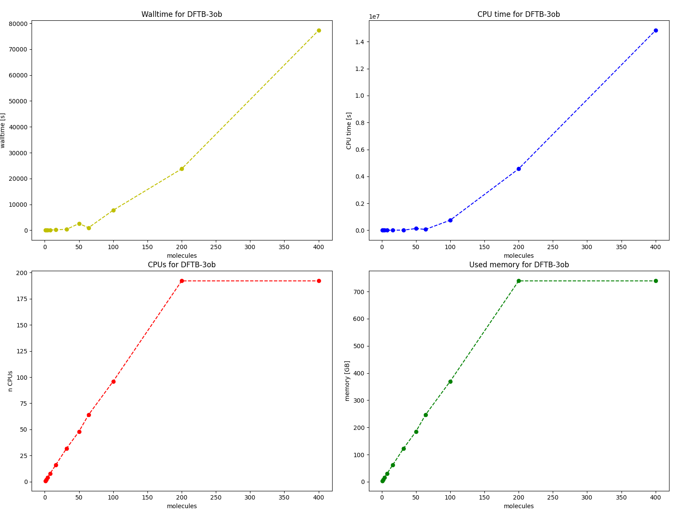
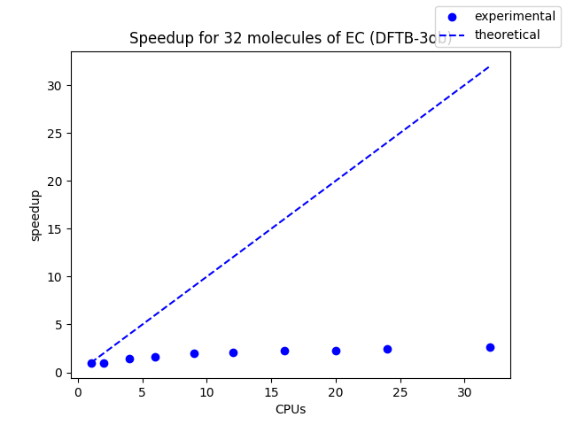
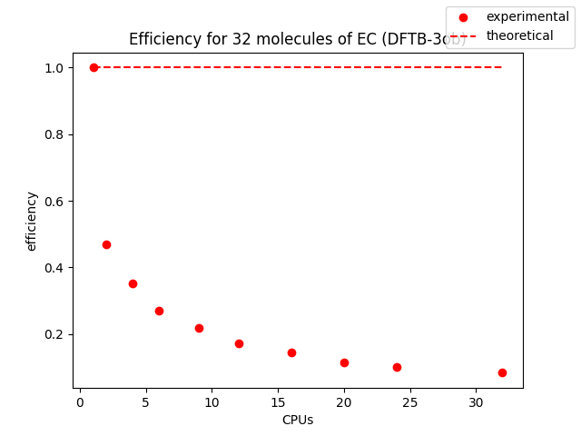
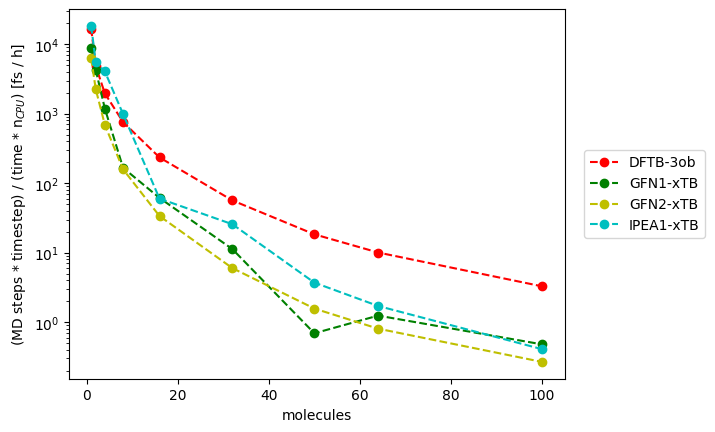

# DFTB+

For experiments, the 3ob-3-1 parameter set was used for standard DFTB calculations. This set could be found at the [official website](dftb.org).

In subdirectories input files for geometry optimization, lattice optimization, DFTB MD with 3ob parameters and for MD performed with xTB approaches: GFN1, GFN2 and IPEA1.

## Guidelines for user

* many use-cases are already described in [DFTB+ recipes](https://dftbplus-recipes.readthedocs.io/en/latest/)
* newer versions changed spelling of some keywords, e.g. GeometryOptimisation not Optimization
* using too much CPUs for too small system causes errors
* maximum studied number of molecules: 400, above that value there appeared errors with memory
* there exists LatticeOptimisation option - during geometry optimisation it optimizes also the unit cell, this process can be customized using options FixedAngles, FixedLengths, Isotropic
* xTB methods after long enough simulation cause out-of-memory errors (for systems above 8 molecules), to not waste time for wating at SLURM queue it is better to run and restart short simulations in a loop during one SLURM task
* IPEA1-xTB method works only for non-periodic systems
* TD-DFTB and Ehrenfest MD needs that the DFTB+ is compiled with ARPACK which requires compilation without MPI. These options are disabled by default on Ares/Prometheus, in case of need to use these utilities it is possible to manually compile own version of DFTB+

# Results of experiments

## Geometry optimization

For the 3ob parameter set, plots of walltime, CPU time, used CPUs and used memory vs number of molecules are presented for geometry optimization task.

Parallelisation studies were performed for a system with 32 EC molecules:

It can be observed that with MPI compilation, parallelisation of DFTB+ is not so effective, thus using large number of CPUs does not make sense.

## Molecular dynamics

Speed of standard DFTB MD with 3ob parameters and xTB approaches (GFN1, GFN2, IPEA1) were compared.

As a metric for each method number of timesteps times value of timestep per (time unit * number of CPUs) was used.

It is clear, that xTB approaches are slower than standard DFTBfor system bigger than 20 molecules. All studied xTB approaches have similar speed, so it is better to use newer GFN2 parametrization than the older GFN1.