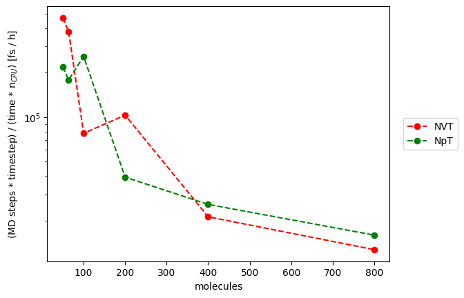

# NAMD

Experiments were made with NVT or NpT ensembles to perform MD simulations. As a force field, parameters from the [article](https://pubs.acs.org/doi/10.1021/acs.jpcb.0c10622) were used. The .prm file with the force field is included in this directory along with .conf input files for NVT and NpT ensembles.

## Guidelines for user

* for small systems (less than 50 molecules) there appeared errors associated with too small unit cell, it is possible to manipulate with the cutoffs, however it is hard (and such small systems are rarely the use case of classical MD)
* the largest simulated system: 800 molecules, systems with 1600 or 3200 molecules has problems with too rapid acceleration of atoms, manipulation with cutoffs did not change anything

# Results of experiments

## Molecular dynamics

Speed of classical MD with NpT or NVT ensembles were measured.

As a metric for each method number of timesteps times value of timestep per (time unit * number of CPUs) was used.

For some systems (e.g. 64 or 200 EC molecules) NpT simulations were quicker, however usually both ensembles has the same speed.